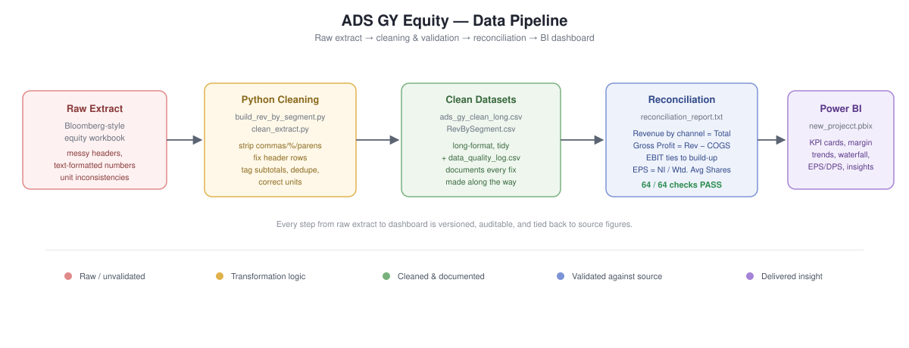
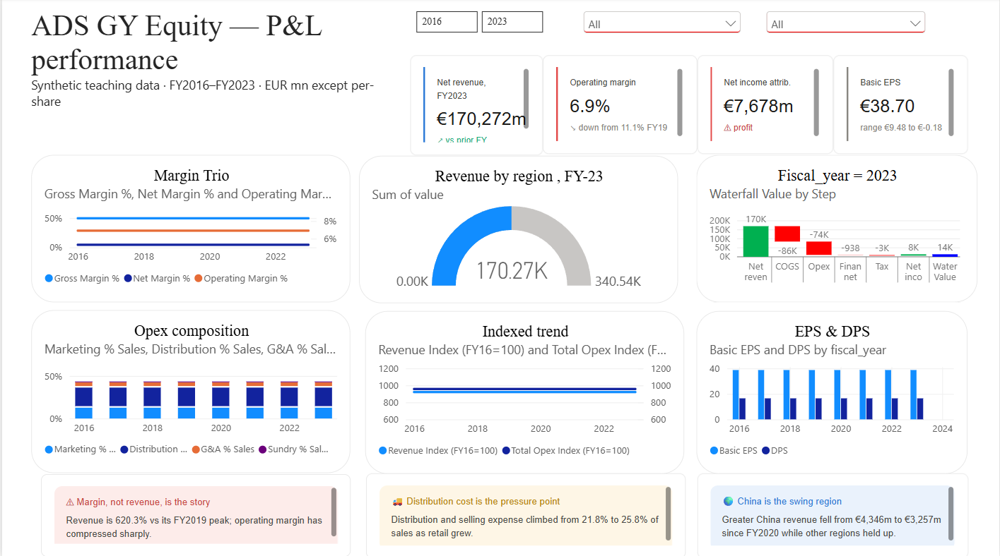

# ADS GY Equity — P&L Performance Dashboard

A synthetic equity-research teaching dataset (styled on Adidas' ticker, **ADS GY**) carried end‑to‑end: a messy Bloomberg‑style financial extract is cleaned and validated in Python, tied out against source figures, and delivered as an interactive Power BI dashboard covering FY2016–FY2023.



## Overview

- **Scope:** Income statement, margins, per-share metrics, and revenue segmentation (category / brand / channel) for FY2016–FY2023.
- **Goal:** Demonstrate a full analyst workflow — extract → clean → validate → visualize — with every transformation documented and every headline number reconciled back to its source.
- **Data:** Fully synthetic; built for practice and portfolio purposes only. It is *not* real ADS GY / Adidas financial data.

## Dashboard preview



The report includes:

| Visual | What it shows |
|---|---|
| KPI cards | Net revenue, operating margin, net income attributable, and basic EPS for the selected year, with prior-year deltas |
| Margin Trio | Gross / net / operating margin % trends, FY2016–2023 |
| Revenue by region (gauge) | Regional revenue split for the selected fiscal year |
| Waterfall | Bridges net revenue down to net income for a given year (COGS → opex → financing → tax) |
| Opex composition | Marketing, distribution, G&A, and sundry expense as % of sales |
| Indexed trend | Revenue vs. total opex, indexed to FY2016 = 100 |
| EPS & DPS | Basic EPS and dividend per share by fiscal year |
| Insight callouts | Auto-generated narrative flags (e.g. margin compression, rising distribution cost, regional swing) |

## Data pipeline

1. **Raw extract** — a Bloomberg-style workbook with the layout quirks real financial extracts actually have: a two-row header, thousands separators and parenthesis-negatives stored as text, embedded footnote markers, and a duplicated subtotal row.
2. **Cleaning scripts** (`build_rev_by_segment.py` and its companion cleaning script) — parse the raw sheet, coerce text-formatted numbers, tag subtotal rows so they're excluded from bottom-up sums, and reshape everything into tidy long-format tables.
3. **Data quality log** (`data_quality_log.csv`) — every issue found during cleaning, the evidence for it, and the exact fix applied (e.g. a FY2018 "Other Businesses" figure extracted in EUR thousands instead of EUR millions, corrected and cross-checked against the segment sheet).
4. **Reconciliation** (`reconciliation_report.txt`) — four independent tie-outs, run for every fiscal year:
   - Revenue by channel sums to Total Net Revenue
   - Gross Profit = Revenue − COGS
   - EBIT ties to its own build-up (Gross Profit + other income − opex)
   - EPS = Net Income Attributable to Shareholders ÷ Weighted Average Basic Shares

   **Result: every check passes for all 8 fiscal years (FY2016–FY2023).**
5. **Power BI report** (`new_projecct.pbix`) — the cleaned, validated tables loaded into a Power BI model and visualized as the dashboard above.

## Repository structure

```
.
├── README.md
├── new_projecct.pbix              # Power BI report file
├── ads_gy_clean_long.csv          # Cleaned income-statement line items, long format
├── RevBySegment.csv               # Revenue by category / brand / channel, long format
├── build_rev_by_segment.py        # Script that builds RevBySegment.csv from the raw extract
├── data_quality_log.csv           # Every data-quality issue found and how it was fixed
├── reconciliation_report.txt      # Output of the tie-out checks against source figures
├── ADS_GY_Master_PL_Model.xlsx    # Working Excel P&L model
└── assets/
    ├── pipeline_diagram.svg
    └── dashboard_preview.png
```

## Tech stack

- **Python** (pandas, openpyxl) — extraction, cleaning, reconciliation
- **Power BI** — data modeling and dashboard

## Reproducing the pipeline

```bash
pip install pandas openpyxl
python build_rev_by_segment.py
```

This regenerates `RevBySegment.csv` from the raw extract workbook and prints a quick sum-by-year reconciliation to the console for a sanity check before loading into Power BI.

## Notes

- All figures are in EUR millions except per-share metrics, unless otherwise noted.
- This project uses synthetic data designed to mimic the structure, quirks, and messiness of a real equity data extract — it is intended purely as a data-cleaning and BI portfolio piece.
